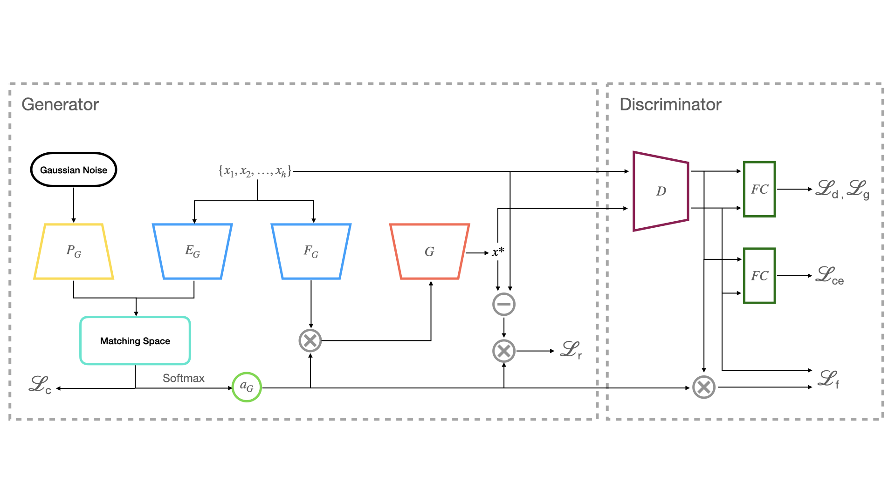

# Code for STL project

Created by Shuai Luo, Cheng Fei, Fan Zhang.

The framework of our initially proposed network.


## Getting Started
### 1. Data Preparation
- **Omniglot**
    
  Categories/Samples: 1412/ 32460
  
  Split: 1200 seen classes, 212 unseen classes
 
- **VGGFace**

  Categories/Samples: 2299/ 229900
  
  Split: 1802 seen classes, 497 unseen classes

Generate npy files for each dataset.
```
python data_preparation.py --data_set --store_path --image_width
```

### 2. Train dagan
```
python train_dagan.py --dataset_path [your path] --final_model_path [your path]
```

### 3. Train dagan with classifier
```
python train_omniglot_classifier.py --dataset_path [your path]
```